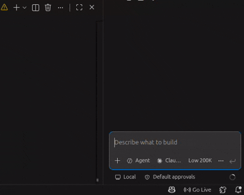

## Step 5: Draft Failing Tests with an AI Coding Agent

You are now starting Wave 2 of this exercise.

### Test-Driven Development (TDD)

Test-Driven Development is a methodology where you write tests **before** writing implementation code. The typical workflow is:

1. **RED**: Write a failing test that describes the desired behavior
2. **GREEN**: Write minimal code to make the test pass
3. **REFACTOR**: Improve the code while keeping tests passing

This approach ensures your code is testable, maintainable, and meets requirements from the start.

Goal for this step:

- Use GitHub Copilot, Claude Code, or Cursor with the `draft-tests` skill.
- Read the requirement from ticket.md.
- Generate failing tests first.
- Commit only test-related changes.

### Activity

1. Open your AI coding agent and invoke the `draft-tests` skill.

```
/draft-tests
```



2. Run tests locally and confirm RED (the new tests fail).

3. Commit and push the changes to `main` (message example: `Draft failing tests for cart checkbox selection`).

### Important constraints for this step

- The commit must contain test-related files only.
- Do not include implementation file changes in this commit.
- CI will run the new tests and expects them to fail in this step.

Wait for 20 seconds and watch the comments for Step 6.
