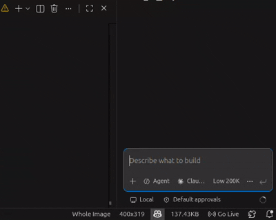

## Step 6: Implement from Frozen Tests

Great. Your failing tests are now frozen from the previous commit.

Goal for this step:

- Implement the feature requested in ticket.md.
- Keep test files unchanged.
- Make the full frontend test suite pass.

### Activity

1. Open your AI coding agent and invoke the `implement-from-tests` skill.

```
/implement-from-tests
```



2. Run the full frontend test suite and confirm GREEN.

3. Commit only implementation files and push.

4. Wait about 20 seconds for evaluation.

### Important constraints for this step

- Do not edit, rename, move, or delete test files.
- CI will fail if test files were altered in this commit.
- CI will fail unless all frontend tests pass.

<details>
<summary>Troubleshoot steps</summary>

- Review the test error messages in the console output
- Check that your implementation matches the requirements in ticket.md
- Ensure all imports and dependencies are correctly added
- Verify the feature logic aligns with the test expectations
- Re-run `npx vitest run` to confirm the fix

</details>
